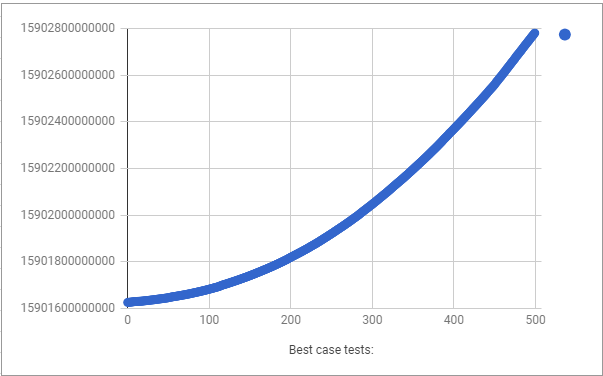
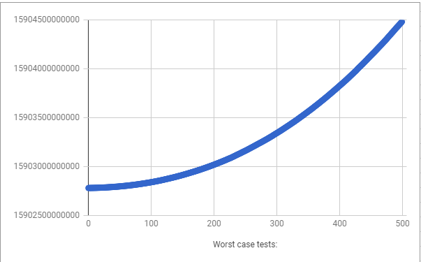
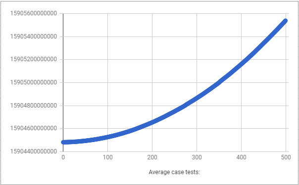

# Yawrricks
Yawrricks - Johnny Wong, Richard Wong, and Zane Wang  
APCS pd1  
L01 -- What Does the Data Say?  
2018-03-14

## Hypothesis
  
 Yawrricks hypothesizes that the best case of QuickSort would be the median as the pivot with a runtime of O(nlogn). 
  The worst case would be a random index of an array as the pivot with a runtime of O(n*n). The average case is approximately
   O(nlogn) with the pivot either being the left or right bound of the array.

   
## Background
  
 Due to requiring communication like a strong team should, we had other applications such as Google Chrome to write code 
   cohesively through https://codeshare.io/ (great site) and Discord for verbal communication. These processes required memory
   which may have slowed down our program. 

   
## Experiment Methodology
  1. Perform 500 trials on the best case, the worst case, and the average case by creating 500 different arrays, that increment
  in size by 100, starting at a size of 1000.
  2. Start timing after these processes have been initialized. Run the quicksort method corresponding to each case, changing the
  pivot depending on the case. Stop timing after each array is sorted.
  3. Print this data into qsort.csv.
  4. Import qsort.csv into Google Spreadsheets in order to create the graphs below.
  
## Results
  Best Case:  
  
  Worst Case:  
  
  Average Case:  
  
  
## Conclusions
